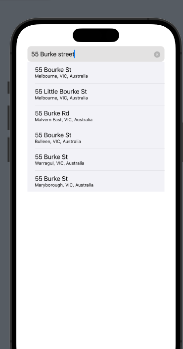

# My Table App

## Contents
- [My Table App](#my-table-app)
  - [Contents](#contents)
  - [Overview](#overview)
  - [Miro Board](#miro-board)
  - [Running the Application](#running-the-application)
    - [Running on Simulator](#running-on-simulator)
    - [Running on Real Device](#running-on-real-device)
  - [Integrations](#integrations)
    - [Firebase Authentication](#firebase-authentication)
  - [Custom Modules](#custom-modules)
    - [Address Autocomplete - (AddressAutocompleteModule)](#address-autocomplete---addressautocompletemodule)
      - [Parameters](#parameters)
      - [Usage Example](#usage-example)
    - [Map Module - (MapModule)](#map-module---mapmodule)
      - [Parameters](#parameters-1)
      - [Usage Example](#usage-example-1)
  - [File Structure](#file-structure)
  - [Contributors](#contributors)

<br/>
<br/>

## Overview

MyTable is a user-friendly app revolutionizing the reservation experience by eliminating queues and wait times at favored venues, catering to a diverse range of options, from cozy cafes to upscale restaurants. The app empowers users to effortlessly browse and secure reservations, by effectively managing the queuing process, where it automatically updates patrons on their queue status and estimated seating time, enhancing transparency. Notably, the app also offers a customer management system where the restaurant can control the reservations and queues. 
<br/>
<br/>

## Miro Board

As we progress through building our application we have tasks managed by weeks. broken down into main tasks in priority from top to bottom and then we have a sub-tasks section for minor tasks completed for view.

The miro board for our group can be found here:

- <a href="https://miro.com/app/board/uXjVMsxYoDQ=/?share_link_id=253530509822" target="_blank">Miro Board - a2_MyTable</a>


<br/>
<br/>

## Running the Application
In order to run the application you require a few specific resources
- Apple Mac computer
- Xcode - <a href="https://apps.apple.com/us/app/xcode/id497799835?mt=12" target="_blank">App Store</a>
- Project files - <a href="https://github.com/rmit-iPSE-s2-2023/a2-s3682040" target="_blank">Github repo</a>
  - you can clone the project via the url or download a zip copy of it
    - 
<br/>

### Running on Simulator
When running the project through the Xcode IDE then you can simply click the `Play` button at the top left of the main window
- 

This will then open the simulator which is a real simulated device to run your application. It may take a sec to load the first time.
The simulator does have a few limitations as it doesn't have access to specific functions such as camera or ML, etc, as these require a real device hardware.
<br/>
<br/>

### Running on Real Device
<br/>
In order to run this on a real device, you can install it on your own iOS device, however this requires a developer account in order to do this.

You can create a developer account <a hrer="https://developer.apple.com/" taregt="_blank">HERE</a> .

Once you have a developer account linked with your apple ID, you need to add it to the project.

To do this select

`MyTable` > `Signing & Capabilities` and then in the `Team` section you need to select your own personal developer accoutn credentials.


Now plugin your device to your machine and you need to turn on `Developer Mode` on your iOS device.
To do that you can follow this guide: <a href="https://docs.expo.dev/guides/ios-developer-mode/" target="_blank">iOS Developer Mode</a>

Then at the top of the screen we can select the device type and in the dropdown it should have your device listed.
Select it and now when you click `Run` it will run on your device directly


<br/>
<br/>

## Integrations

In the MyTable application we are using a couple integrations to simplify various functionality such as Authentication.
<br/>
### Firebase Authentication

Firebase authentication allows us to use their services to create and verify users so we don't have to spend the time to do it ourselves.
This also means they manage their own updates and security for the services.
We have created a guide on how the implementation is integrated and how to use and verify with the service. This can be found here:

<a href="./readme-assets/MyTable-Firebase-Authentication-Integration.pdf" target="_blank">Firebase Authentication MyTable Integration</a>

<br/>
<br/>

## Custom Modules

These are small components that are reusable through the application

<br/>

### Address Autocomplete - (AddressAutocompleteModule)
<br/>

The address autocomplete is an adjustment of an existing SwiftUI autocomplete code by Maksim Kalik (<a href="https://github.com/maxkalik/address-autocomplete-swiftui" target="_blank">https://github.com/maxkalik/address-autocomplete-swiftui</a>).

We have customised it in our solution by editing the style, the conditional rendering and also to populate particular values being passed through.

In our app we want to be able to have an address edit details section that uses real addresses from a lookup and this could be used for either customer, restaurant, or any other potential usage.

The original implementation is for the address update for the restaurant profile:


This field can be placed in any form and when the address is entered it does a local search to find any matching addresses and a dropdown is displayed to the user.

On selecting the address from the dropdown it updates the `fullAddress` of the provided bound value as well as the `longitude` and `latitude` of the address location which can be used for `annotatedItems` to display as positions on a map.



#### Parameters

It can be used by instantiating it with 3 values:
- `fullAddress` => A String value
- `longitude` => Boolean value
- `latitude` => Boolean value

And these values are bound to the model that is passed through to it in order to keep the state. An example of this is the restaurantModel can be broken up and passed into it and then it changes in the autocmplete it updates the model for the restaurant directly.

#### Usage Example

The usage in the `EditRestaurantProfile` is below:
```
AddressAutocompleteModule(fullAddress: $restaurantProfileModel.fullAddressString, longitude: $restaurantProfileModel.longitude, latitude: $restaurantProfileModel.latitude)
```

This allows for it to be reusable and not only having the usage for restaurants

<br/>
<br/>

### Map Module - (MapModule)

The original concept for the map and annotations were attained from Week 9 Lecture - Shekhar Kalra (Presented in lecture as demonstartion)

In order to display restaurants within the application we have created a custom Map Component that allows for various parameters so the same component can be used in multiple places to reduce duplicate map code.

At first glance it appears like a standard map within the application and can displat various points of interest via `annotatedItems`.


The map can be used to display a single point of interest, for example when looking up a single venue, it will display a single point and have the region shown for that restaurant. 
However it can also set the region and display multiple points of interest, such as when searching for a loction and venues close by.

In order to make this component reusable it does not directly access any `environmentObjects` or models (such as customer or venue models), it has the values passed through to it and uses them.
The map doesn't edit any data sent to it, it simply displays the data provided to it.

#### Parameters

The parameters that are used are:
- `location` => `String` -  If only the location is passed through then it shows that single location on the map and uses it for the region, generally used when wanting to display a single venue
- `interactionMode` -> Can set if the map can be interacted with, by default it's all adjustable and set as `.all`
  - Options are:
    - `.pan`
    - `.zoom`
    - `.all`
- `venueAddresses` => `(String Array)` - if there are values in here then it uses these string address values to render the annotations on the map and the `location` above to set the region - MUST be used with `location`
- `restaurantModelList` => `(Array of RestaurantModel)` - if provided, then it uses the longitude and latitude of each restaurant to display them on the map

 `location` MUST be provided when searching for single venue or using the  `venueAddresses` string array, if not provided when passing the `restaurantModelList` array through then the region is set to the location of the first restaurant in the list

#### Usage Example

- **Location Only**
  - Single point of interest
```
MapModule(location: "1 Acland Street, St Kilda, Melbourne")
```

- **Location and Multiple Address Points**
  - location and multiple venues provided as an array of full string addresses
```
MapModule(location: "1 Acland Street, St Kilda, Melbourne", venueAddresses: ["1 Acland Street, St Kilda, Melbourne", "5 Acland Street, St Kilda, Melbourne", "6 Acland Street ,St Kilda, Melbourne"])
```

- **Location and Restaurant Model**
  - this is when the restaurant object is passed through as it has it's own longitude and latitude in the model to define the annotation items to display on the map
```
let restaurant1 = RestaurantModel(venueId: UUID().uuidString, name: "testing name", slug: "testing slug", cuisine: "italian", image: "", distance: 1.0, rating: 4.0, phone: "0400000000", websiteUrl: "http://#", menuUrl: "#", featuredImages: [], latitude: -37.813629, longitude: 144.963058, numOfQueue: 0, inQueue: [])
        
        
MapModule(location: "1 Acland Street, St Kilda, Melbourne", restaurantModelList: [restaurant1])
```

<br/>
<br/>

## File Structure

The files are designed to keep specific functionality and views broken into their own relevent sections.
This allows for better readability and organisation of resources.

The folder structure outline can be seen below:

```
MyTable/ 
├─ Assets 
├─ Extensions 
│  └─ LocationServiceExtension.swift 
│     ... 
├─ DataModels 
│  └─ CustomerDataModel.swift 
│     ... 
├─ Views 
│  └─ ContentView.swift 
│  └─ MyTableData.xcdatamodel 
│     ... 
├─ Modules 
│  └─ Restaurant 
│     	└─ RestaurantDetailsModule.swift 
│	   ... 
│  └─ AuthenticationModule.swift 
│	... 
├─ Models 
│  └─ RestaurantModel.swift 
│	... 
├─ Helpers 

│  └─ GlobalHelper.swift 
│	... 
├─ Services 
│  └─ AuthenticationService.swift 
│_	... 
```
- **Extensions** - Extensions to services such as in order to use mapkit in a way we required we needed to extend some CoreLocation functions
- **DataModels** - contains the data model structures and CoreData store where locally stored data resides
- **Views** - hold all the page views 
- **Modules** – contains the broken down modular view components that can be placed within the Views 
- **Models** – contains all the object models for their structure and data mapping 
- **Helpers** – contains any helper functions and views that areglobally used across the app 
- **Services** – contain service related resources such as api requests so that the views and modules themselves do not run any of the service logic 

<br/>
<br/>

## Contributors
Hyeonbin Hur - s3740878

Pascal Couturier - s3682040
